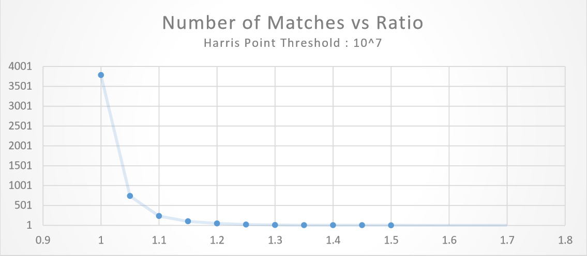
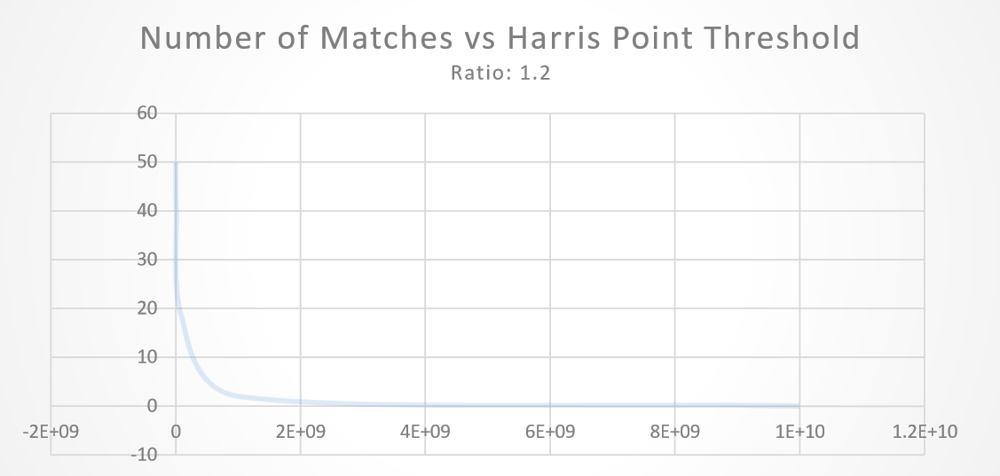
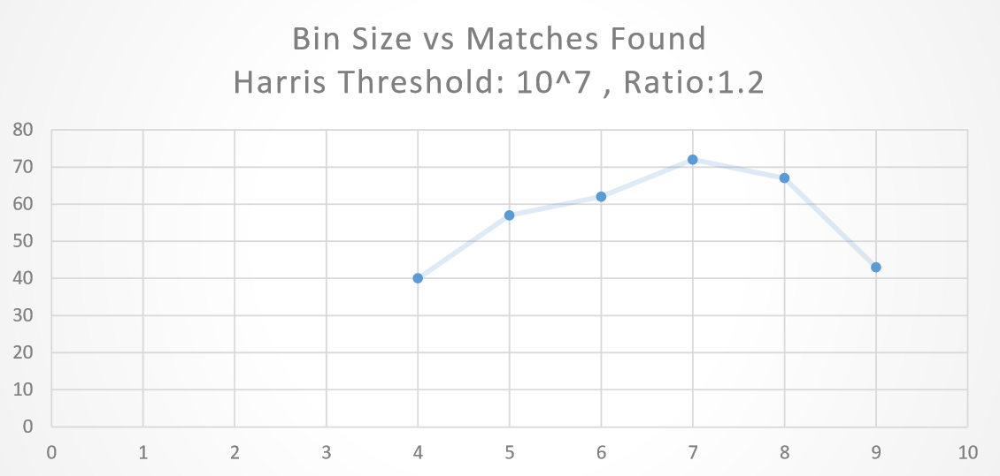
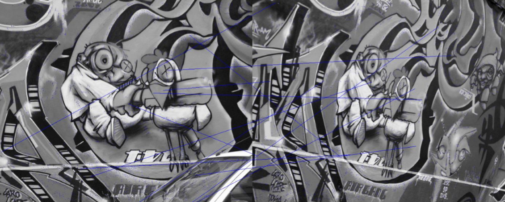
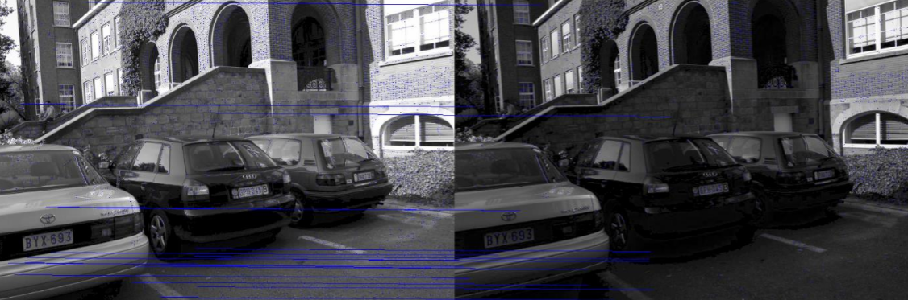
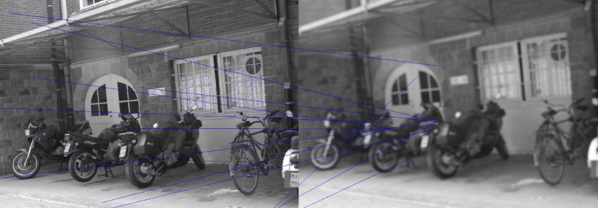

# Harris Point Detection and Image Matching

## Overview

### Interest Point Detection
Interest point detection is done by creating a gradient matrix and choose a window around every pixel and generate the Harris matrix for this window.

Then we apply a threshold on the eigen values to obtaing harris responses, which are then checked for local maxima and noted as a corner.

Instead of solving for eigen values we use the Harris operator to threshold. By the end of this process we have the interest points in images of interest

### Feature Descriptor
We’ll now charaterise every Harris Point with a feature descriptor.

The feature in this case is a Histogram Vector, whose bins denote the direction of gradients.

We’ll use the histogram values as feature coordinates of every point. (Bin size * Patch size)

### Image Matching
We’ll now compute distance between every Interest point in template with Interest points in the second and find the one whose distance is the lowest and second lowest.

We now take a ratio of second smallest to first smallest and threshold it obtain only those matches which aren’t ambiguos.  

### Results
Here, the above matching has been performed on various images and the results vary widely over thresholds.

The first threshold on Harris Response seems to have an asymptotic decay on the number of matches obtained.

The threshold on ratio affects the matches exponentially too.

### Tests
These are some of the images the tests were run on

#### SET 1

+ Threshold: 1000000
+ Ratio: 1.15  
+ Matches: 13
+ Corners in 1: 4081     
+ Corners in 2: 4090

#### SET 2

+ Threshold: 1000000  
+ Ratio: 1.2   
+ Matches: 44
+ Corners in 1: 6206  
+ Corners in 2: 3895

#### SET 3

+ Threshold: 10000000  
+ Ratio: 1.15   
+ Matches: 12
+ Corners in 1: 2854  
+ Corners in 2: 33  

As can be seen the results are very good set 2, as could be estimated because the images are very familiar orthographically.  

But in set 3 although locational similarity is good, the bluring of image has caused too much loss of information for the SIFT feature descriptor to encode.

The first one has too many ambiguos matches to choose from, hence it goes hay wire in correctly pairing up the interest points, although it does some very good matches
